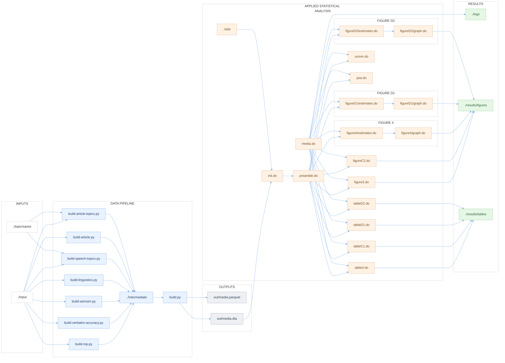
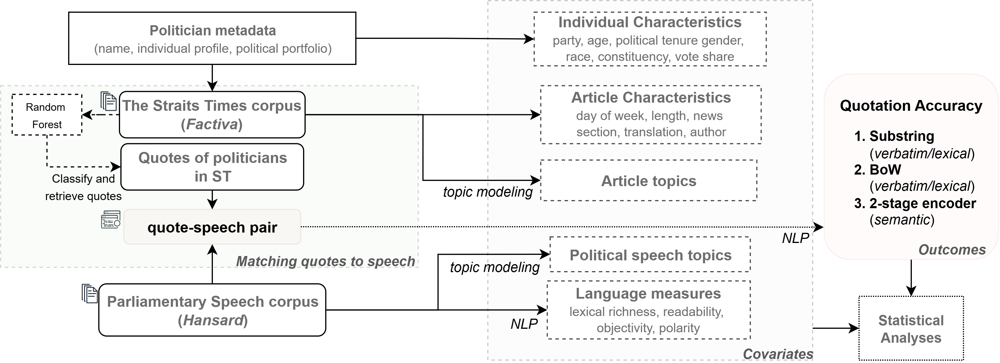

# Shades of Neutrality: Detecting Media Slant Using Quotation Accuracy

## 📄 Summary
A natural starting point in the study of political media bias has been to examine differences in coverage intensity.
 This study develops a notion of quotation accuracy as a dimension of media slant.
 Using natural language processing (NLP), I operationalize three measures of quotation accuracy---substring alignment, bag-of-words overlap, and a two-stage transformer-based semantic measure.
 I combine the measures with applied econometrics to analyze coverage of parliamentary speeches in Singapore's flagship daily newspaper, a setting where coverage intensity shows no slant.
 Across all three measures, opposition speeches are quoted less accurately than those of the ruling party, demonstrating accuracy as a crucial yet underappreciated dimension of slant.
 NLP and machine learning features, and bounding analyses rule out competing explanations such as topical composition, ignorable tokens, or linguistic coherence.
 I then contextualize the findings in the government-media machinery, where transcript circulations (or lack thereof) could explain lapses in quotation accuracy.
 I theorize that these partisan differences in media engagement embed private information about slant.


## 📁 Repository Structure

```bash
.
├── .github/
│   └── workflows/
│
├── analysis/             # Stata analysis scripts
│   ├── ado/              # Custom Stata programs
│   ├── figure4/          # Figure 4 components
│   ├── figureD1/         # Appendix figure D1
│   ├── figureD2/         # Appendix figure D2
│   ├── logs/             # Analysis logs
│   ├── init.do           # Initialization & settings
│   ├── media.do          # Main do file
│   ├── preamble.do       # Data preamble and variable definitions
│   ├── figure3.do
│   ├── figureC2.do
│   ├── psa.do
│   ├── summ.do
│   ├── table3.do
│   ├── tableC1.do
│   ├── tableD1.do
│   └── tableD2.do
│	
├── pipeline/             # Python data processing
│   ├── input/            # Raw data inputs
│   ├── intermediate/     # Intermediate outputs
│   ├── out/              # Final dataset
│   ├── topic/            # LDA models
│   ├── build-article-topics.py
│   ├── build-article.py
│   ├── build-linguistics.py
│   ├── build-mp.py
│   ├── build-semsim.py
│   ├── build-speech-topics.py
│   ├── build-verbatim-accuracy.py
│   ├── build.py          # Builds analysis data
│   ├── utilities.py      # Helper functions
│   └── Makefile          # Automation
│
├── results/              # Generated outputs
│   ├── figures/          # (PDF/PNG/EPS/TIF)
│   ├── tables/           # (LaTeX/md table fragments)
│   └── readme.md         
│
├── assets/               # Dependencies & resources
│   ├── 2stage.mmd
│   ├── 2stage.png
│   ├── 2stage.svg
│   ├── dag.mmd
│   ├── dag.png
│   ├── dag.svg
│   ├── media-logistics-drawio.png
│   ├── media-logistis.drawio.xml
│   ├── media-pipeline.drawio.xml
│   ├── media-pipeline.png
│   ├── requirements-locked.txt
│   └── requirements.txt
│
├── Makefile              
├── README.md             
└── references.bib        
```

The pipeline consists of **two main stages**: (1) Python data processing, and (2) statistical analysis.

 

### 🔄 Stage 1: Data Processing Pipeline (Python)

#### Pipeline Components

| Script | Description |
|--------|-------------|
| `build-mp.py` | Politician metadata (party, electoral data, ministerial roles) |
| `build-article.py` | Article processing and feature extraction |
| `build-article-topics.py` | LDA topic model for articles (K=40) |
| `build-speech-topics.py` | LDA topic model for speeches (K=92) |
| `build-verbatim-accuracy.py` | Substring and bag-of-words accuracy |
| `build-linguistics.py` | Linguistic features (readability, lexical richness) |
| `build-semsim.py` | Semantic similarity (transformer-based) |
| `build.py` | Integration into final panel dataset |


#### Running the Pipeline
```bash
cd pipeline
make data
```
Or run `build.py` to build final panel from `./pipeline/intermediate/`.
```bash
cd pipeline
python build.py
```

**Output:** `./pipeline/out/media.*`

#### Sample Composition

- **14,901** quote-speech pairs
- **5,129** speeches by **204** politicians
- **3,421** news articles
- **Period**: 2005–2016 (4 parliaments)

📝 Complete variable definitions in [`analysis/preamble.do`](./analysis/preamble.do)

### 📊 Stage 2: Statistical Analysis

#### Running the Analysis

To reproduce all tables and figures:

```stata
cd analysis
do media.do
```



#### Outputs

Results saved to [`./results/`](./results/):
- `tables/` → LaTeX (`.tex`) and text (`.md`) tables
- `figures/` → PDF/PNG/EPS/TIF figures

See [results](https://github.com/LSYS/neutrality/tree/main/results)

[](https://github.com/LSYS/neutrality/actions/workflows/retraction_checker.yml)
