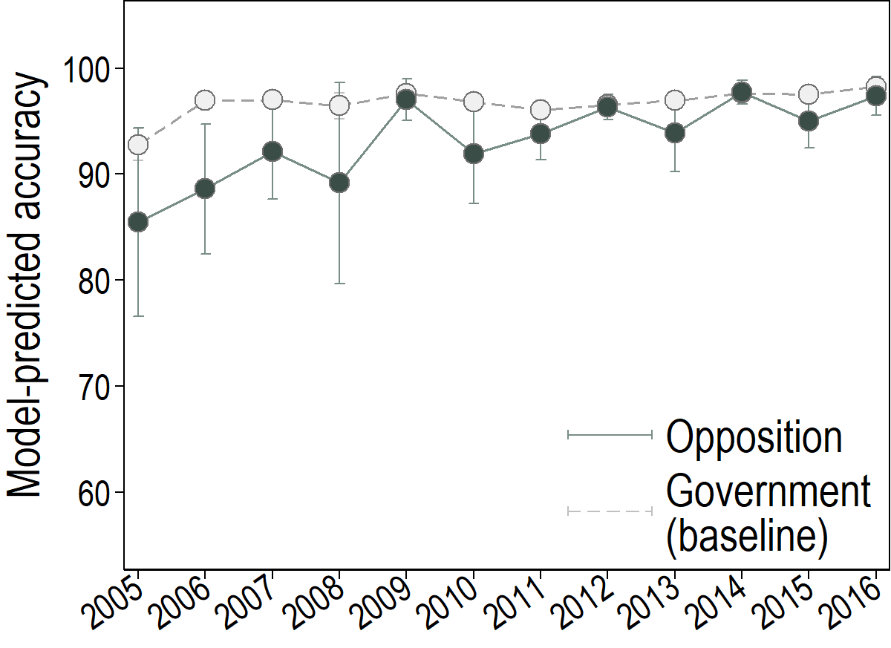
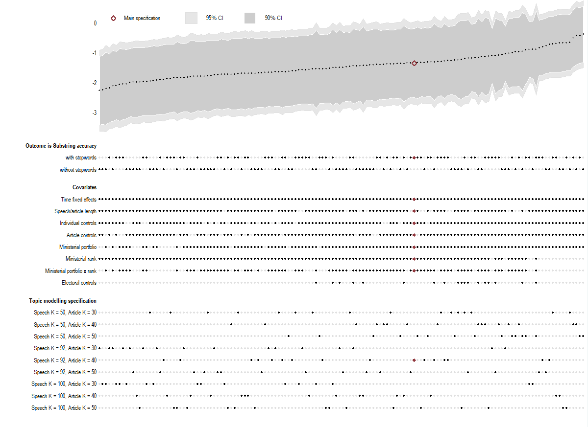

## Results

### Main

#### Figure 2

#### Table 3
|              |          (1)    |          (2)    |          (3)    |          (4)    |          (5)    |          (6)    |
| ------------ | :-------------: | :-------------: | :-------------: | :-------------: | :-------------: | :-------------: |
| Opposition   |        -1.47**  |        -1.27*   |        -2.34*** |        -1.99*** |        -5.36*** |        -4.39*** |
|              |       (0.70)    |       (0.75)    |       (0.70)    |       (0.64)    |       (1.52)    |       (1.52)    |
| Time fixed-effects |            x    |            x    |            x    |            x    |            x    |            x    |
| Individual controls |            x    |            x    |            x    |            x    |            x    |            x    |
| Article controls |            x    |            x    |            x    |            x    |            x    |            x    |
| Topic controls |            x    |            x    |            x    |            x    |            x    |            x    |
| Ministerial controls |            x    |            x    |            x    |            x    |            x    |            x    |
| Electoral controls |                 |            x    |                 |            x    |                 |            x    |
| *R*2 |        0.160    |        0.188    |        0.111    |        0.119    |        0.158    |        0.192    |
| F-statistic, time fixed-effects |   4.89^{***}    |   2.87^{***}    |   4.14^{***}    |    2.06^{**}    |   3.36^{***}    |    2.36^{**}    |
| F-statistic, individual controls |    2.07^{**}    |          .79    |    2.03^{**}    |          .74    |         1.66    |      1.7^{*}    |
| F-statistic, topic controls |   2.01^{***}    |   1.91^{***}    |   1.65^{***}    |   1.48^{***}    |   1.89^{***}    |   1.83^{***}    |
| F-statistic, ministerial controls |   3.69^{***}    |   3.01^{***}    |   2.37^{***}    |   1.94^{***}    |    2.9^{***}    |   2.43^{***}    |
| F-statistic, electoral controls |                 |         1.06    |                 |         1.26    |                 |    2.88^{**}    |
| Mean of dependent variable |        91.56    |        91.98    |        96.66    |        96.85    |        89.94    |        90.31    |
| N            | \multicolumn{1}{c}{   14,850}    | \multicolumn{1}{c}{   10,872}    | \multicolumn{1}{c}{   14,850}    | \multicolumn{1}{c}{   10,872}    | \multicolumn{1}{c}{   14,850}    | \multicolumn{1}{c}{   10,872}    |

Standard errors in parentheses 
* *p* < 0.1, ** *p* < 0.05, *** *p* < 0.01

#### Figure 3
<table>
  <tr>
    <td width="34%" align="center">
       
      <b>(a) Substring</b>
    </td>
    <td width="34%" align="center">
       
      <b>(b) BoW</b>
    </td>
    <td width="34%" align="center">
       
      <b>(c) Semantic</b>
    </td>
  </tr>
</table>

#### Figure 4

#### Figure 5

### Intensity

#### Figure C1/C2? (combine?)

#### Table C1

### Sensitivity
#### Table D1

#### Figure D1

#### Fogire D2

#### Table D2
