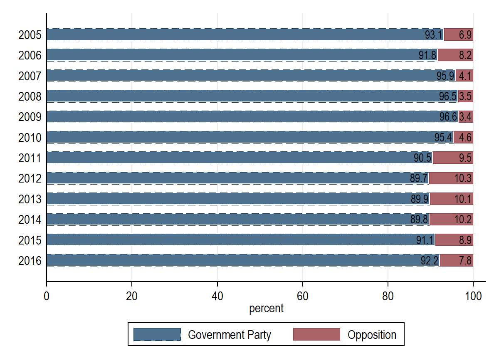
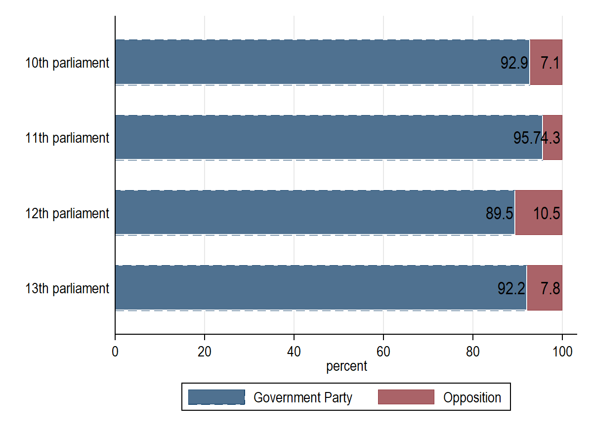
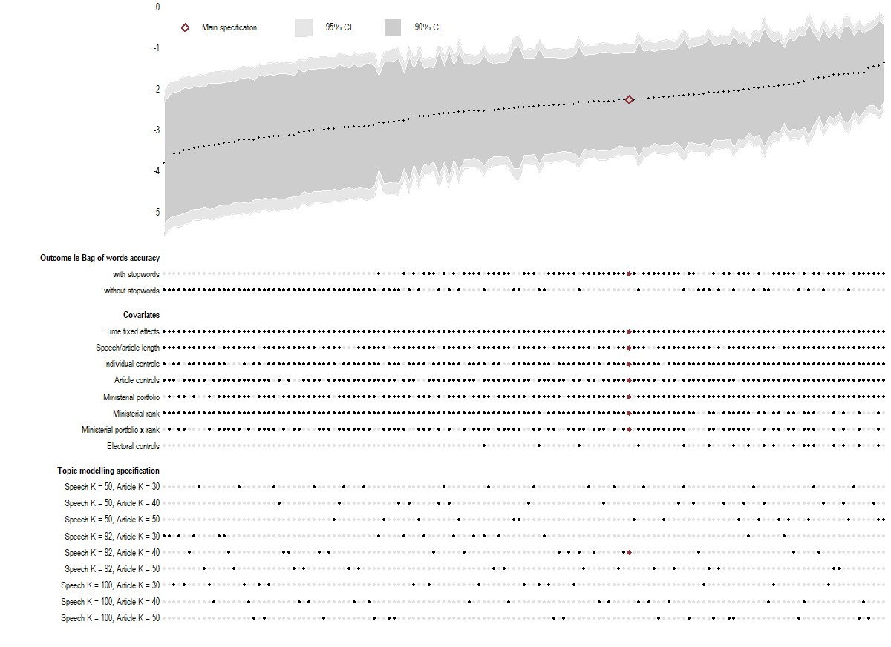
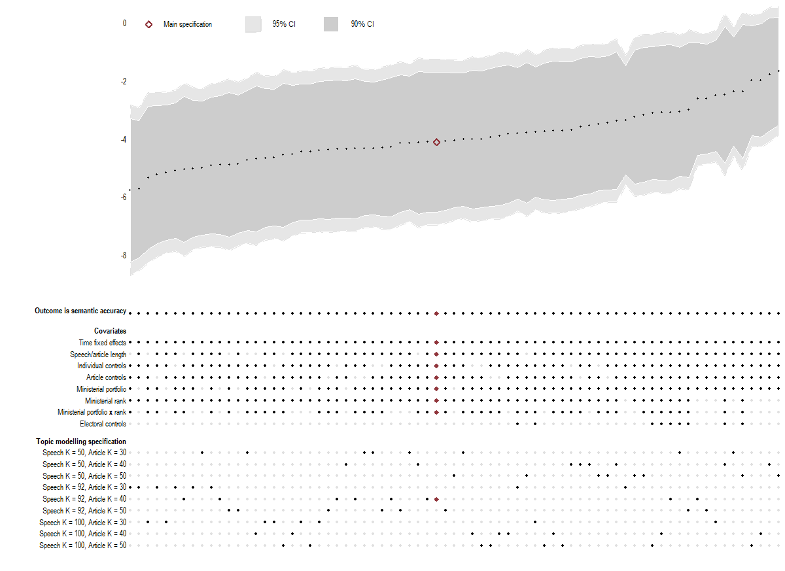

[sensitivity-panelF-semantic-accuracy-nearperfect.md](https://github.com/user-attachments/files/23769853/sensitivity-panelF-semantic-accuracy-nearperfect.md)[add-linguistics-panelC-semantic-accuracy.md](https://github.com/user-attachments/files/23768933/add-linguistics-panelC-semantic-accuracy.md)[add-linguistics-panelB-bow-accuracy.md](https://github.com/user-attachments/files/23768927/add-linguistics-panelB-bow-accuracy.md)[add-linguistics-panelA-substring-accuracy.md](https://github.com/user-attachments/files/23768896/add-linguistics-panelA-substring-accuracy.md)[sensitivity-panelF-semantic-accuracy-binarized99.md](https://github.com/user-attachments/files/23768520/sensitivity-panelF-semantic-accuracy-binarized99.md)[sensitivity-panelE-semantic-accuracy.md](https://github.com/user-attachments/files/23768515/sensitivity-panelE-semantic-accuracy.md)[sensitivity-panelD-bow-accuracy-nostopwords.md](https://github.com/user-attachments/files/23768511/sensitivity-panelD-bow-accuracy-nostopwords.md)[sensitivity-panelC-bow-accuracy.md](https://github.com/user-attachments/files/23768507/sensitivity-panelC-bow-accuracy.md)[sensitivity-panelB-substring-accuracy-nostopwords.md](https://github.com/user-attachments/files/23768504/sensitivity-panelB-substring-accuracy-nostopwords.md)[sensitivity-panelA-substring-accuracy.md](https://github.com/user-attachments/files/23768499/sensitivity-panelA-substring-accuracy.md)[main-article-speech-quote-coverage.md](https://github.com/user-attachments/files/23768492/main-article-speech-quote-coverage.md)[main-quote-lvl-estimates-fragment.md](https://github.com/user-attachments/files/23768478/main-quote-lvl-estimates-fragment.md)## Results

------
### Main

#### Figure 2

#### Table 3

|              |          (1)    |          (2)    |          (3)    |          (4)    |          (5)    |          (6)    |
| ------------ | :-------------: | :-------------: | :-------------: | :-------------: | :-------------: | :-------------: |
| Opposition   |        -1.85**  |        -1.37*   |        -2.12*** |        -1.64**  |        -4.10*** |        -2.99**  |
|              |       (0.72)    |       (0.76)    |       (0.70)    |       (0.65)    |       (1.46)    |       (1.44)    |
| Time fixed-effects |            x    |            x    |            x    |            x    |            x    |            x    |
| Individual controls |            x    |            x    |            x    |            x    |            x    |            x    |
| Article controls |            x    |            x    |            x    |            x    |            x    |            x    |
| Topic controls |            x    |            x    |            x    |            x    |            x    |            x    |
| Ministerial controls |            x    |            x    |            x    |            x    |            x    |            x    |
| Electoral controls |                 |            x    |                 |            x    |                 |            x    |
| *R*2 |        0.181    |        0.204    |        0.111    |        0.117    |        0.233    |        0.270    |
| F-statistic, time fixed-effects |   4.68^{***}    |   2.99^{***}    |   4.05^{***}    |    2.07^{**}    |   4.18^{***}    |     2.5^{**}    |
| F-statistic, individual controls |    2.04^{**}    |          .82    |     1.75^{*}    |          .56    |         1.02    |         1.43    |
| F-statistic, topic controls |   1.68^{***}    |   1.55^{***}    |    1.27^{**}    |    1.26^{**}    |    1.25^{**}    |     1.2^{**}    |
| F-statistic, ministerial controls |   3.76^{***}    |   2.93^{***}    |   2.42^{***}    |   1.93^{***}    |   3.01^{***}    |   2.29^{***}    |
| F-statistic, electoral controls |                 |          .89    |                 |         1.82    |                 |    3.23^{**}    |
| Mean of dependent variable |        91.53    |        91.94    |        96.63    |        96.84    |        89.80    |        90.27    |
| N            | \multicolumn{1}{c}{   14,426}    | \multicolumn{1}{c}{   10,898}    | \multicolumn{1}{c}{   14,426}    | \multicolumn{1}{c}{   10,898}    | \multicolumn{1}{c}{   14,426}    | \multicolumn{1}{c}{   10,898}    |

Standard errors in parentheses 
* *p* < 0.1, ** *p* < 0.05, *** *p* < 0.01

#### Figure 3
<table>
  <tr>
    <td width="34%" align="center">
       
      <b>(a) Substring</b>
    </td>
    <td width="34%" align="center">
       
      <b>(b) BoW</b>
    </td>
    <td width="34%" align="center">
       
      <b>(c) Semantic</b>
    </td>
  </tr>
</table>

#### Figure 4

#### Figure 5

------------
### Intensity

#### Figure C2

<table>
  <tr>
    <td width="50%" align="center">
       
      <b>(a) By year</b>
    </td>
    <td width="50%" align="center">
       
      <b>(b) By parliament </b>
    </td>
  </tr>
</table>

#### Table C1
|              |          (1)    |          (2)    |
| ------------ | :-------------: | :-------------: |
| Opposition   |         0.04    |         0.02    |
|              |       (0.06)    |       (0.08)    |
| Time fixed-effects |            x    |            x    |
| Individual controls |            x    |            x    |
| Article controls |            x    |            x    |
| Topic controls |            x    |            x    |
| Ministerial controls |            x    |            x    |
| Electoral controls |                 |            x    |
| *N*          |         7094    |         5140    |
| *R*2 |        0.180    |        0.193    |

Standard errors in parentheses 
* *p* < 0.1, ** *p* < 0.05, *** *p* < 0.01

------------
### Sensitivity
#### Table D1

##### Panel A. Substring

|              | (1) Baseline Regression    | (2) Journalist FE    | (3) No ministerial controls    | (4) No translations    | (5) Cluster by speech    | (6) Cluster by journalist    | (7) Speech K = 50    | (8) Speech K = 100    | (9) Article K = 30    | (10) Article K = 50    | (11) Sentence topics    | (12) Parsimonious topics    |
| ------------ | :-------------: | :-------------: | :-------------: | :-------------: | :-------------: | :-------------: | :-------------: | :-------------: | :-------------: | :-------------: | :-------------: | :-------------: |
| Opposition   |        -1.86*** |        -2.05*** |        -1.68*** |        -1.68**  |        -1.86**  |        -1.86**  |        -1.53**  |        -1.78**  |        -2.16*** |        -1.88*** |        -1.87*** |        -1.74**  |
|              |       (0.71)    |       (0.77)    |       (0.55)    |       (0.70)    |       (0.75)    |       (0.73)    |       (0.72)    |       (0.72)    |       (0.70)    |       (0.71)    |       (0.71)    |       (0.70)    |
| *N*          |        14901    |        13524    |        14901    |        14697    |        14901    |        14901    |        14901    |        14901    |        14901    |        14901    |        14901    |        14901    |

##### Panel B. Substring (no stopwords)

|              | (1) Baseline Regression    | (2) Journalist FE    | (3) No ministerial controls    | (4) No translations    | (5) Cluster by speech    | (6) Cluster by journalist    | (7) Speech K = 50    | (8) Speech K = 100    | (9) Article K = 30    | (10) Article K = 50    | (11) Sentence topics    | (12) Parsimonious topics    |
| ------------ | :-------------: | :-------------: | :-------------: | :-------------: | :-------------: | :-------------: | :-------------: | :-------------: | :-------------: | :-------------: | :-------------: | :-------------: |
| Opposition   |        -1.94*** |        -2.20*** |        -1.71*** |        -1.75**  |        -1.94**  |        -1.92**  |        -1.59**  |        -1.94*** |        -2.27*** |        -1.99*** |        -1.95*** |        -1.83*** |
|              |       (0.72)    |       (0.78)    |       (0.56)    |       (0.71)    |       (0.76)    |       (0.77)    |       (0.72)    |       (0.73)    |       (0.71)    |       (0.72)    |       (0.72)    |       (0.71)    |
| *N*          |        14901    |        13524    |        14901    |        14697    |        14901    |        14901    |        14901    |        14901    |        14901    |        14901    |        14901    |        14901    |

##### Panel C. BoW
|              | (1) Baseline Regression    | (2) Journalist FE    | (3) No ministerial controls    | (4) No translations    | (5) Cluster by speech    | (6) Cluster by journalist    | (7) Speech K = 50    | (8) Speech K = 100    | (9) Article K = 30    | (10) Article K = 50    | (11) Sentence topics    | (12) Parsimonious topics    |
| ------------ | :-------------: | :-------------: | :-------------: | :-------------: | :-------------: | :-------------: | :-------------: | :-------------: | :-------------: | :-------------: | :-------------: | :-------------: |
| Opposition   |        -2.15*** |        -2.41*** |        -1.63*** |        -2.04*** |        -2.15*** |        -2.13*** |        -1.97*** |        -2.11*** |        -2.38*** |        -2.07*** |        -2.13*** |        -2.20*** |
|              |       (0.70)    |       (0.75)    |       (0.55)    |       (0.70)    |       (0.71)    |       (0.78)    |       (0.72)    |       (0.72)    |       (0.70)    |       (0.69)    |       (0.70)    |       (0.71)    |
| *N*          |        14901    |        13524    |        14901    |        14697    |        14901    |        14901    |        14901    |        14901    |        14901    |        14901    |        14901    |        14901    |

##### Panel D. BoW (no stopwords)

|              | (1) Baseline Regression    | (2) Journalist FE    | (3) No ministerial controls    | (4) No translations    | (5) Cluster by speech    | (6) Cluster by journalist    | (7) Speech K = 50    | (8) Speech K = 100    | (9) Article K = 30    | (10) Article K = 50    | (11) Sentence topics    | (12) Parsimonious topics    |
| ------------ | :-------------: | :-------------: | :-------------: | :-------------: | :-------------: | :-------------: | :-------------: | :-------------: | :-------------: | :-------------: | :-------------: | :-------------: |
| Opposition   |        -2.88*** |        -3.18*** |        -2.04*** |        -2.76*** |        -2.88*** |        -2.92*** |        -2.57*** |        -2.85*** |        -3.22*** |        -2.81*** |        -2.86*** |        -2.89*** |
|              |       (0.91)    |       (0.99)    |       (0.70)    |       (0.92)    |       (0.93)    |       (1.10)    |       (0.93)    |       (0.94)    |       (0.90)    |       (0.89)    |       (0.92)    |       (0.91)    |
| *N*          |        14901    |        13524    |        14901    |        14697    |        14901    |        14901    |        14901    |        14901    |        14901    |        14901    |        14901    |        14901    |

##### Panel E. Semantic
|              | (1) Baseline Regression    | (2) Journalist FE    | (3) No ministerial controls    | (4) No translations    | (5) Cluster by speech    | (6) Cluster by journalist    | (7) Speech K = 50    | (8) Speech K = 100    | (9) Article K = 30    | (10) Article K = 50    | (11) Sentence topics    | (12) Parsimonious topics    |
| ------------ | :-------------: | :-------------: | :-------------: | :-------------: | :-------------: | :-------------: | :-------------: | :-------------: | :-------------: | :-------------: | :-------------: | :-------------: |
| Opposition   |        -4.05*** |        -4.68*** |        -2.97*** |        -3.69**  |        -4.05*** |        -4.23**  |        -3.25**  |        -3.71**  |        -4.87*** |        -4.06*** |        -4.01*** |        -3.92*** |
|              |       (1.46)    |       (1.59)    |       (1.13)    |       (1.45)    |       (1.48)    |       (1.66)    |       (1.46)    |       (1.49)    |       (1.43)    |       (1.45)    |       (1.47)    |       (1.42)    |
| *N*          |        14901    |        13524    |        14901    |        14697    |        14901    |        14901    |        14901    |        14901    |        14901    |        14901    |        14901    |        14901    |

##### Panel F. Semantic (binarized; near perfect sim)

|              | (1) Baseline Regression    | (2) Journalist FE    | (3) No ministerial controls    | (4) No translations    | (5) Cluster by speech    | (6) Cluster by journalist    | (7) Speech K = 50    | (8) Speech K = 100    | (9) Article K = 30    | (10) Article K = 50    | (11) Sentence topics    | (12) Parsimonious topics    |
| ------------ | :-------------: | :-------------: | :-------------: | :-------------: | :-------------: | :-------------: | :-------------: | :-------------: | :-------------: | :-------------: | :-------------: | :-------------: |
| Opposition   |        -0.04*   |        -0.04**  |        -0.03**  |        -0.03*   |        -0.04*   |        -0.04*   |        -0.03    |        -0.03    |        -0.04**  |        -0.04**  |        -0.03*   |        -0.03*   |
|              |       (0.02)    |       (0.02)    |       (0.01)    |       (0.02)    |       (0.02)    |       (0.02)    |       (0.02)    |       (0.02)    |       (0.02)    |       (0.02)    |       (0.02)    |       (0.02)    |
| *N*          |        14901    |        13524    |        14901    |        14697    |        14901    |        14901    |        14901    |        14901    |        14901    |        14901    |        14901    |        14901    |

Standard errors in parentheses 
* *p* < 0.1, ** *p* < 0.05, *** *p* < 0.01

#### Figure D1

#### Figure D2

------------
#### Table D2

##### Panel A. Substring

|              | (1) Baseline    | (2) +Objectivity    | (3) +Polarity    | (4) +Readability    | (5) +Lexical    |     (6) +All    |
| ------------ | :-------------: | :-------------: | :-------------: | :-------------: | :-------------: | :-------------: |
| Opposition   |        -1.86*** |        -1.81**  |        -1.86*** |        -2.12*** |        -1.76**  |        -2.02*** |
|              |       (0.71)    |       (0.71)    |       (0.71)    |       (0.71)    |       (0.71)    |       (0.72)    |
| Objectivity of speech and quote |                 |        -0.13**  |                 |                 |                 |        -0.13**  |
|              |                 |       (0.06)    |                 |                 |                 |       (0.06)    |
| Polarity of speech and quote |                 |                 |        -0.02    |                 |                 |        -0.03    |
|              |                 |                 |       (0.06)    |                 |                 |       (0.06)    |
| Grade/readability score of speech transcipt |                 |                 |                 |         0.65*** |                 |         0.64*** |
|              |                 |                 |                 |       (0.08)    |                 |       (0.09)    |
| Lexical richness of speech transcipt |                 |                 |                 |                 |         0.36*** |         0.31*** |
|              |                 |                 |                 |                 |       (0.08)    |       (0.08)    |
| *N*          |        14901    |        14899    |        14899    |        14890    |        14848    |        14836    |

##### Panel B. BoW

|              | (1) Baseline    | (2) +Objectivity    | (3) +Polarity    | (4) +Readability    | (5) +Lexical    |     (6) +All    |
| ------------ | :-------------: | :-------------: | :-------------: | :-------------: | :-------------: | :-------------: |
| Opposition   |        -2.15*** |        -2.12*** |        -2.14*** |        -2.24*** |        -2.15*** |        -2.23*** |
|              |       (0.70)    |       (0.70)    |       (0.70)    |       (0.70)    |       (0.70)    |       (0.70)    |
| Objectivity of speech and quote |                 |        -0.08    |                 |                 |                 |        -0.08    |
|              |                 |       (0.05)    |                 |                 |                 |       (0.05)    |
| Polarity of speech and quote |                 |                 |         0.02    |                 |                 |         0.01    |
|              |                 |                 |       (0.05)    |                 |                 |       (0.05)    |
| Grade/readability score of speech transcipt |                 |                 |                 |         0.22*** |                 |         0.22*** |
|              |                 |                 |                 |       (0.07)    |                 |       (0.08)    |
| Lexical richness of speech transcipt |                 |                 |                 |                 |         0.14*   |         0.12    |
|              |                 |                 |                 |                 |       (0.08)    |       (0.08)    |
| *N*          |        14901    |        14899    |        14899    |        14890    |        14848    |        14836    |

##### Panel C. Semantic

|              | (1) Baseline    | (2) +Objectivity    | (3) +Polarity    | (4) +Readability    | (5) +Lexical    |     (6) +All    |
| ------------ | :-------------: | :-------------: | :-------------: | :-------------: | :-------------: | :-------------: |
| Opposition   |        -4.05*** |        -4.10*** |        -4.10*** |        -4.08*** |        -3.88*** |        -3.97*** |
|              |       (1.46)    |       (1.46)    |       (1.46)    |       (1.46)    |       (1.46)    |       (1.46)    |
| Objectivity of speech and quote |                 |         0.09    |                 |                 |                 |         0.08    |
|              |                 |       (0.12)    |                 |                 |                 |       (0.13)    |
| Polarity of speech and quote |                 |                 |        -0.10    |                 |                 |        -0.07    |
|              |                 |                 |       (0.12)    |                 |                 |       (0.13)    |
| Grade/readability score of speech transcipt |                 |                 |                 |         0.09    |                 |         0.05    |
|              |                 |                 |                 |       (0.16)    |                 |       (0.17)    |
| Lexical richness of speech transcipt |                 |                 |                 |                 |         0.42*** |         0.41*** |
|              |                 |                 |                 |                 |       (0.15)    |       (0.15)    |
| *N*          |        14901    |        14899    |        14899    |        14890    |        14848    |        14836    |

Standard errors in parentheses 
* *p* < 0.1, ** *p* < 0.05, *** *p* < 0.01
